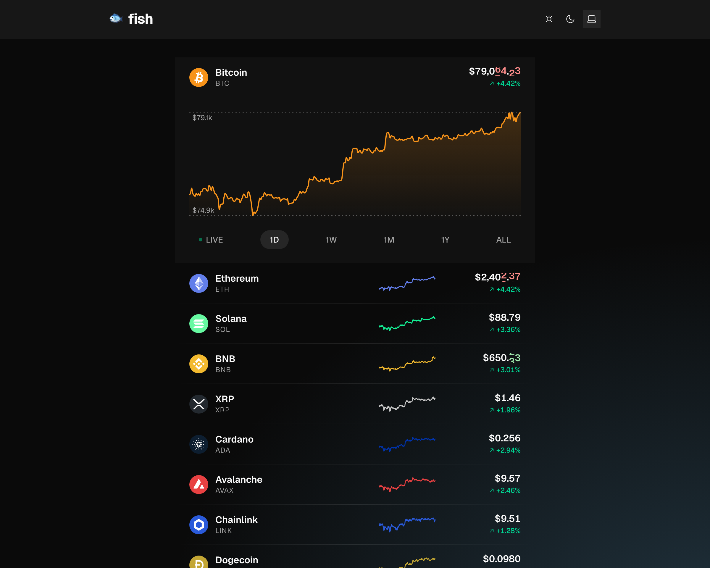

# 🐟 fish

Live crypto prices and price history for 10 curated USDT pairs. All 10
are listed at once with live prices and 24h sparklines; tap any row to
expand a full chart with selectable time frames. Sub-second updates
over WebSocket, zero sign-up. Powered by the public Binance APIs.



## Features

- 10 liquid USDT pairs in one view: BTC, ETH, SOL, BNB, XRP, ADA, AVAX,
  LINK, DOGE, LTC
- Live price for every row, streamed in real time via Binance combined
  WebSocket (one connection, ten `@kline_5m` subscriptions)
- 24h sparklines per row, amended live as new 5m bars close
- Click-to-expand accordion revealing an interactive area chart with
  LIVE / 1D / 1W / 1M / 1Y / ALL time frames
- Click-drag brush on the chart to measure the change between any two
  points
- Brand-color accents per coin
- Light, dark, and system themes

## Running

```bash
pnpm install
pnpm dev             # http://localhost:5174
pnpm build           # type-check and build for production
pnpm test            # run unit + e2e suites
```

Playwright needs its browser downloaded once before `pnpm test`:

```bash
pnpm exec playwright install chromium
```

## Stack

Vite + React 19 + TypeScript, Tailwind CSS v4, Radix primitives, and
Recharts for the chart. State lives in Jotai atoms (per-symbol atom
families for prices and sparklines), WebSocket messages are validated
with Zod at the network boundary, and the stream connection is handled
by partysocket.
